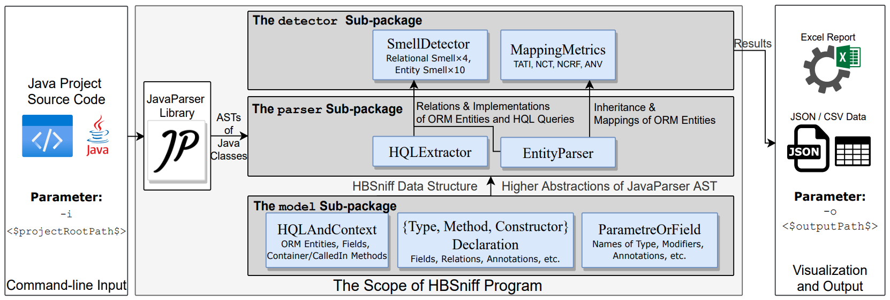

# Guide for Developers

## Compilation       
Video Demo of Compilation and Execution: https://doi.org/10.6084/m9.figshare.16682029         

1. Clone [the GitHub repository](https://github.com/HBSniff/HBSniff) of HBSniff. 
2. Open it with an IDE, we suggest using IntelliJ IDEA. 
3. Since the dependencies and compilation of the project is managed by Maven 5, a ```maven clean install``` command will automatically download dependencies and generate an executable jar file in the ```target``` folder, e.g., HBSniff-1.6.7-jar-with-dependencies.jar.

## Architecture


HBSniff consists of 5 major modules (sub-packages), i.e., ```model, parser, detector, metric, util```. First, users specify the path of projects and the directory of output. Then, the ```parsers``` of HQL and Hibernate entities construct the HBSniff AST ```models``` using ```JavaParser```. Afterwards, the ```models``` will be used to populate the context of code smell ```detectors``` and ```metrics```, and the detection and evaluation will be performed. Finally, the results will be transferred to Excel reports as well as csv and JSON data. 

## Implement a new smell detector

1. Create a detector class named ```$detectorName$``` implementing ```SmellDetector``` in ```io.github.hzjdev.hbsniff.detector.rules``` package.
2. Implement the ```exec()``` method from the ```SmellDetector``` interface, detection rules could be specified here. To use the parsed ASTs and ```Declarations```, please refer to the [SmellDetector](smellDetector.md) section for more details.       
3. Add a ```SmellType Enumeration``` named ```$detectorName$``` in the ```SmellDetectorFactory``` class, this will allow the static factory to automatically initialize the implemented detector.  
4. Do not forget to implement unit tests for the new detectors.

## Implement a new metric

For a better performance, currently all mapping metrics are implemented in ```io.github.hzjdev.hbsniff.metric.MappingMetrics``` since they share similar logics and could be evaluated in a similar fashion. 

To implement different metrics, we suggest following the architecture of smell detectors, i.e., create a static factory and related ```Enumerations```. The architecture of metric evaluation may be improved in the future.     

See also the [Mapping Metrics](mappingMetricsEvaluator.md) section for more information.

## Evaluate a project without specifying commandline parametres
Please refer to the first 2 ```String``` constants of ``` io.github.hzjdev.hbsniff.utils.Const``` class.

```java
    public final static String DEFAULT_INPUT_PATH = "D:\\tools\\hql\\projects\\BroadleafCommerce";
    public final static String DEFAULT_OUTPUT_PATH = "D:\\tools\\hql\\projects";
```
If ```-i``` and ```-o``` is not specified, an error will be raised, but HBSniff will still try to execute according to these 2 default parametres.