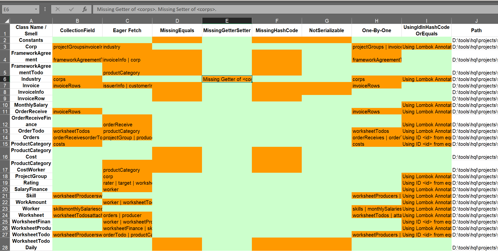

# Excel Report


HBSniff exports an Excel report of the analyzed commercial project.  Undetected smells will not present in the Excel.  Fields in orange represents smelly, and texts in these fields are corresponding comments (e.g., affected entity attributes). Light green fields refer to clean entities.       

This functionality is implemented in ```generateXlsReport``` method of the ```ProjectSmellReport``` class using ```Apache POI```.   

# csv and JSON
These 2 files contain the raw data of the output Smell instances, for example:      

```json
{        
    "D:\\tools\\hql\\projects\\BroadleafCommerce\\core\\broadleaf-profile\\src\\main\\java\\org\\broadleafcommerce\\profile\\core\\domain\\AddressImpl.java": [  
        "name": "Eager Fetch",
        "file": "D:\\tools\\hql\\projects\\BroadleafCommerce\\core\\broadleaf-profile\\src\\main\\java\\org\\broadleafcommerce\\profile\\core\\domain\\AddressImpl.java",
        "position": "(line 177,col 5)-(line 177,col 102)",
        "className": "AddressImpl",
        "comment": "country"
    ]
}
```   

This functionality is implemented in the ```Util``` class using ```OpenCSV``` and ```gson``` over the ```ProjectSmellReport``` object. 